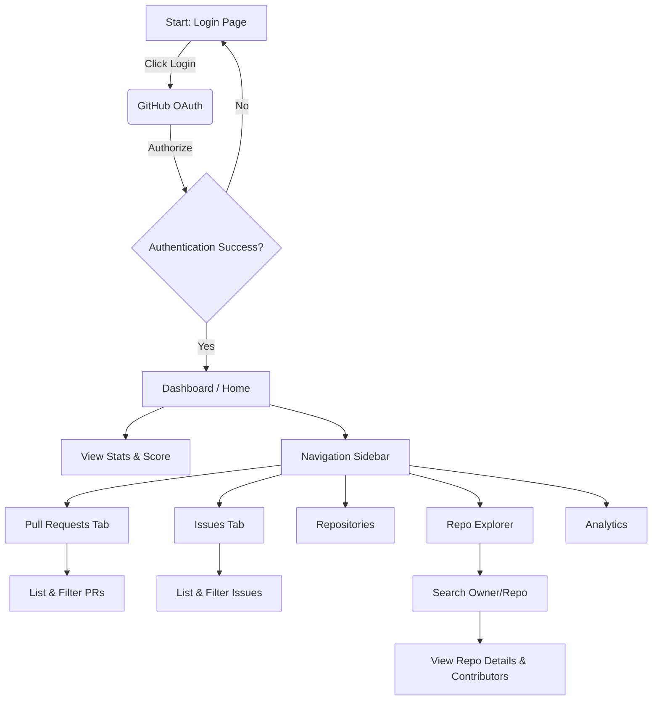
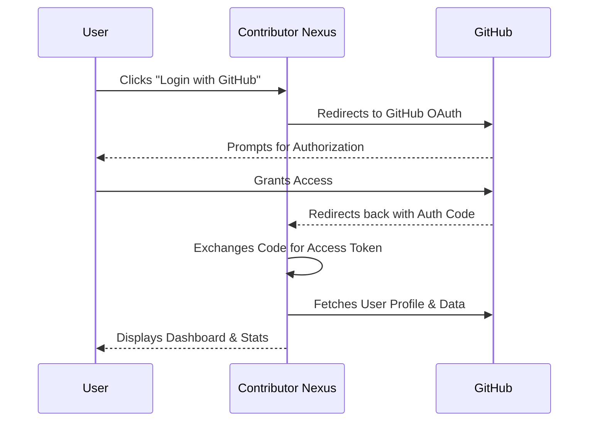
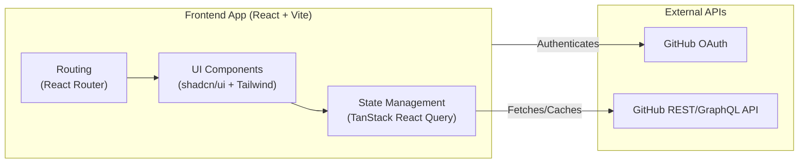

# Contributor Nexus

Contributor Nexus is an intelligent dashboard designed for managing GitHub contributions, tracking Pull Requests and Issues, and exploring repositories with ease. Built with modern web technologies, it provides a seamless and insightful experience for open-source contributors and project maintainers.

## ✨ Features

- **GitHub OAuth Integration**: Securely log in and authenticate users via GitHub.
- **Personalized Dashboard**: Get an overview of your open, merged, and closed PRs, as well as open and closed issues. Includes a derived contribution score.
- **Pull Request & Issue Tracking**: Detailed views for all your PRs and Issues, fetched directly from the GitHub API.
- **Repository Explorer**: Dive deep into any GitHub repository to view its details, recent issues, and top contributors.
- **Global Search**: Quickly search for PRs and issues across your accessible repositories.
- **Dark/Light Mode**: Full support for both themes using modern UI components.

## 🚀 Tech Stack

This project is built using:
- **Frontend Framework**: [React](https://reactjs.org/) + [Vite](https://vitejs.dev/)
- **Language**: [TypeScript](https://www.typescriptlang.org/)
- **Styling**: [Tailwind CSS](https://tailwindcss.com/)
- **UI Components**: [shadcn/ui](https://ui.shadcn.com/) (built on Radix UI)
- **Data Fetching & State**: [TanStack React Query](https://tanstack.com/query/latest)
- **Routing**: [React Router](https://reactrouter.com/)
- **Animations**: [Framer Motion](https://www.framer.com/motion/)
- **Icons**: [Lucide React](https://lucide.dev/)

## 🌊 Application Flow Diagram

Below is the user journey flow illustrating the application's navigation and structure:



## 🔐 OAuth Sequence Diagram

This diagram shows how Contributor Nexus securely authenticates users via GitHub:



## 🏗️ Architecture Diagram

A high-level view of how the application is structured:



## 🛠️ Getting Started

Follow these instructions to get a local copy up and running.

### Prerequisites

- Node.js (v18 or higher recommended)
- npm or bun

### Installation

1. **Clone the repository**
   ```bash
   git clone <YOUR_GIT_URL>
   cd <YOUR_PROJECT_NAME>
   ```

2. **Install dependencies**
   ```bash
   npm install
   # or
   bun install
   ```

3. **Start the development server**
   ```bash
   npm run dev
   # or
   bun run dev
   ```

4. **Open the app**
   Visit `http://localhost:8080` (or the port specified by Vite in your console) in your browser.

## 🤝 Contributing

Contributions, issues, and feature requests are welcome!

1. Fork the Project
2. Create your Feature Branch (`git checkout -b feature/AmazingFeature`)
3. Commit your Changes (`git commit -m 'Add some AmazingFeature'`)
4. Push to the Branch (`git push origin feature/AmazingFeature`)
5. Open a Pull Request
